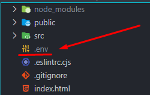

```sh
.+"+.+"+.+"+.+"+.+"+.+"+.+"+.+"+.+"+.+"+.+"+.+"+.+"+.+"+. 
(      ____            _   _               _ ____       )
 )    |  _ \ _   _ ___| |_(_) ___ __ _    | / ___|      ( 
(     | |_) | | | / __| __| |/ __/ _` |_  | \___ \      )
 )    |  _ <| |_| \__ \ |_| | (_| (_| | |_| |___) |     ( 
(     |_| \_\\__,_|___/\__|_|\___\__,_|\___/|____/      )
 )                                                      ( 
 "+.+"+.+"+.+"+.+"+.+"+.+"+.+"+.+"+.+"+.+"+.+"+.+"+.+"+.+" 
```

> [!WARNING]
> Para la ejecucion del proyecto es necesario tener lo que se pide a continuacion.

### Prerequisitos

1. Node (NPM se instala por defecto) 
  ```markdown
   https://nodejs.org/en/download/
  ```

2. Instalar PNPM (Version mejorado de NPM)

  ```sh
   npm install -g pnpm
  ```

### Instalación

1. Clona el repositorio

   ```sh
   git clone https://github.com/withoutnicks/rustica-js.git
   ```

2. Instala los paquetes de NPM

   ```sh
   pnpm install
   ```

3. Crear un archivo **.env** en la raiz del proyecto y leer **read.txt**

<p align="center">



</p>

> [!CAUTION]
> No saltarse este paso, leyendo el archivo lo entendera

4. Ejecuta el proyecto

   ```sh
   pnpm dev
   ```